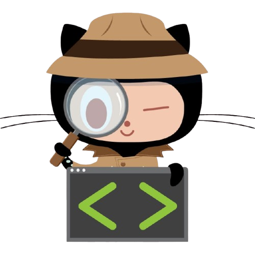

## 🙇🏿‍♂️E ai! Eu sou o Kauã Alexandre de Oliveira Santana e quero ser um programador

✅Estas são as linguagens que estou aprendendo

  
Minhas metas em 2025

  <ul>
    <li>Retomar o estudo de Python pela plataforma Curso em Vídeo</li>
    <li>Concluir o modulo 3 de HTML 5 e CSS 3 do Curso em Vídeo</li>
  </ul>

